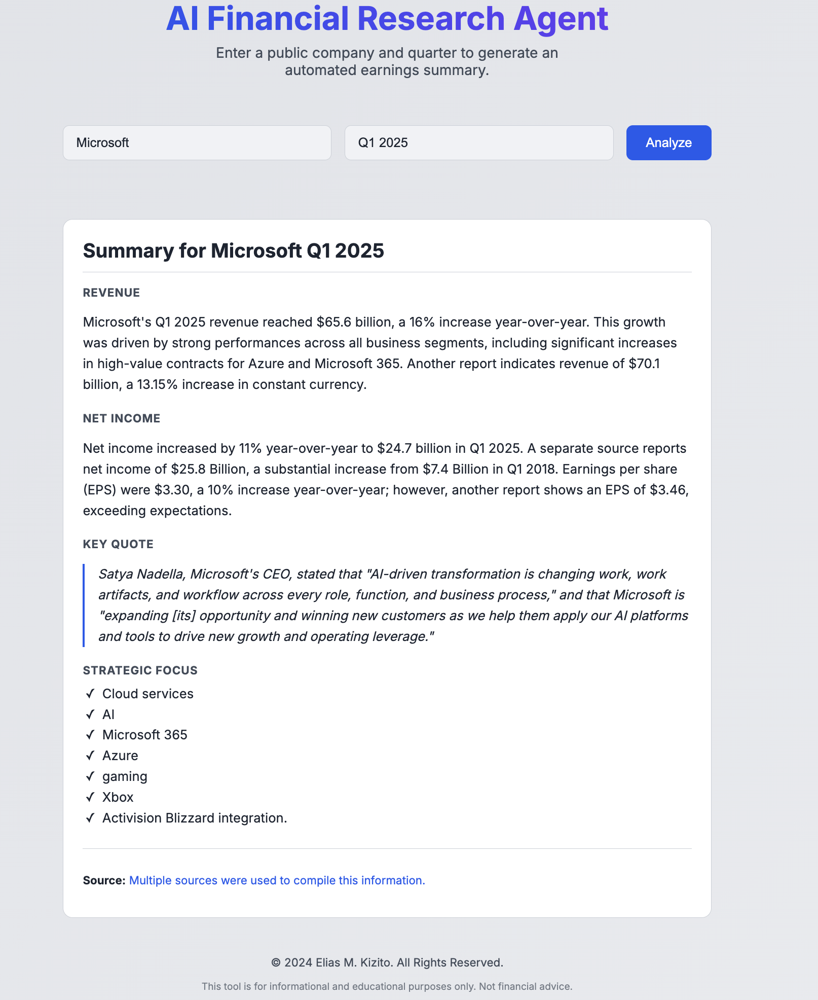

# 🤖 AI Financial Research Agent

*A zero-friction earnings-insights generator for client-facing pros.*

> **Skip the PDF hunt.** Type “Microsoft Q1 2024” and get a board-room-ready summary—revenue deltas, strategic themes, and executive sound-bites, all in one call.

✅ **Live agent available**


*Note: To add a screenshot, save an image named `screenshot.png` in your project's root folder and push it to GitHub.*

---

## 💡 Why I Built It

As a **Client Partner**, I’m constantly asked to translate raw financial results into crisp talking-points for growth conversations.
The traditional workflow is painful: Google → 10-Ks → copy/paste → late-night slides.

This agent collapses that grunt work into a single endpoint so revenue leaders, account managers, and analysts can spend time on **insight—not collection**.

---

## 🚀 How It Works: The Evolution of an Agent

This project showcases a deliberate evolution in technical strategy, moving from a traditional, brittle pipeline to a modern, resilient AI-native approach.

| Step | Old School (Brittle) | ✅ Current Agent (Resilient) |
| :--- | :--- | :--- |
| **1. Search** | Manual Google search | Gemini 1.5 Flash “Google Search” tool |
| **2. Scrape** | Playwright / BeautifulSoup (often blocked) | Native retrieval inside the model |
| **3. Summarize** | Summarize with a separate, simple prompt | One integrated prompt for search & summary |
| **4. Structure** | Stitch results together in Python code | AI orchestrates the summary internally |

This modern approach works behind strict corporate firewalls because it doesn't use traditional scraping bots that trigger security alarms.

---

## ✨ Key Features

- **Autonomous Search + Synthesis**: Gemini finds and digests the most recent 10-Q or press release.
- **Clean REST API**: A `GET /analyze` endpoint accepts `{ company, quarter }` and returns structured JSON.
- **Polished UI**: A lightweight frontend built with vanilla JavaScript and CSS, served directly by Flask.
- **Robust Parsing**: A custom Python function reliably parses the AI's natural language output into a clean data structure.

---

## 🧱 Tech Stack

| Layer | Tech |
| :--- | :--- |
| **AI** | Google Generative AI SDK (Gemini 1.5 Flash) |
| **Backend** | Python 3.11 • Flask • Gunicorn |
| **Frontend** | HTML5 • CSS3 • Vanilla JavaScript |
| **Deployment** | Render (API & UI) |

---

## 🛠 Getting Started

To get a local copy up and running, follow these simple steps.

### Prerequisites

* An active Conda installation
* Python 3.11

### Setup & Run

1.  **Clone the repo**
    ```bash
    git clone [https://github.com/eliasmukasa/financial-agent.git](https://github.com/eliasmukasa/financial-agent.git)
    cd financial-agent
    ```

2.  **Set up Conda environment**
    ```bash
    conda create -n finagent python=3.11
    conda activate finagent
    pip install -r requirements.txt
    ```

3.  **Set up API key**
    * Create a file named `.env` in the root directory.
    * Add your Gemini API key to it:
        ```
        GEMINI_API_KEY="your-api-key-here"
        ```

4.  **Run the server**
    ```bash
    flask run --port=8080
    ```
    Then navigate to `http://localhost:8080` in your browser.

---

## ⚠️ Usage Limits & Notes

| Category | Detail |
| :--- | :--- |
| **Rate Limit** | Uses the free Gemini tier, which has a limit of ~60 requests/minute. A `429` error means you should wait a moment and try again. |
| **Freshness** | Data is as current as Google's search index, which is typically minutes behind live press releases. |
| **Disclaimer** | This is a personal portfolio project to demonstrate technical skill. It is not a financial analysis tool and should not be used for investment decisions. |

---

*Made with ☕ and a healthy disrespect for copy-pasting financial tables.*
